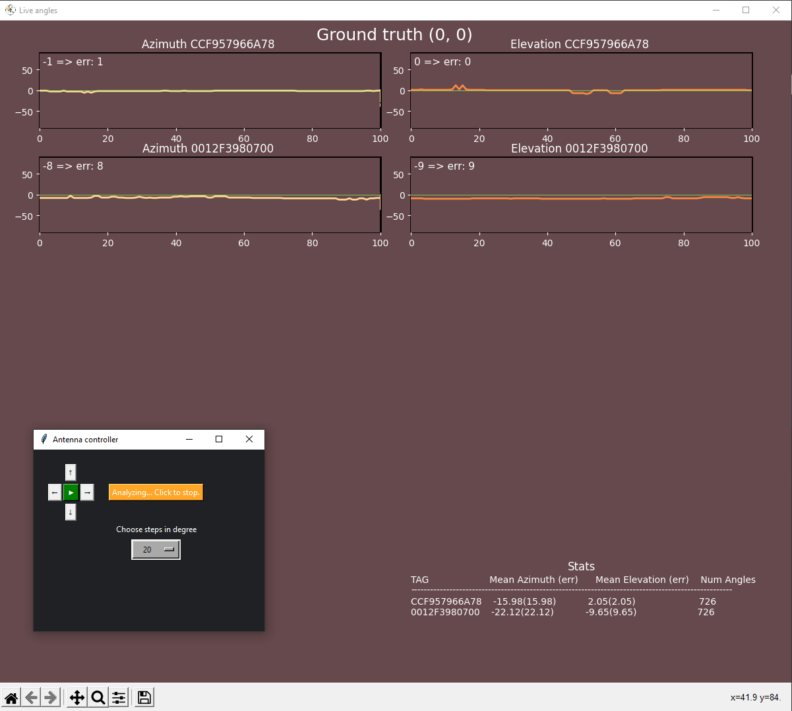
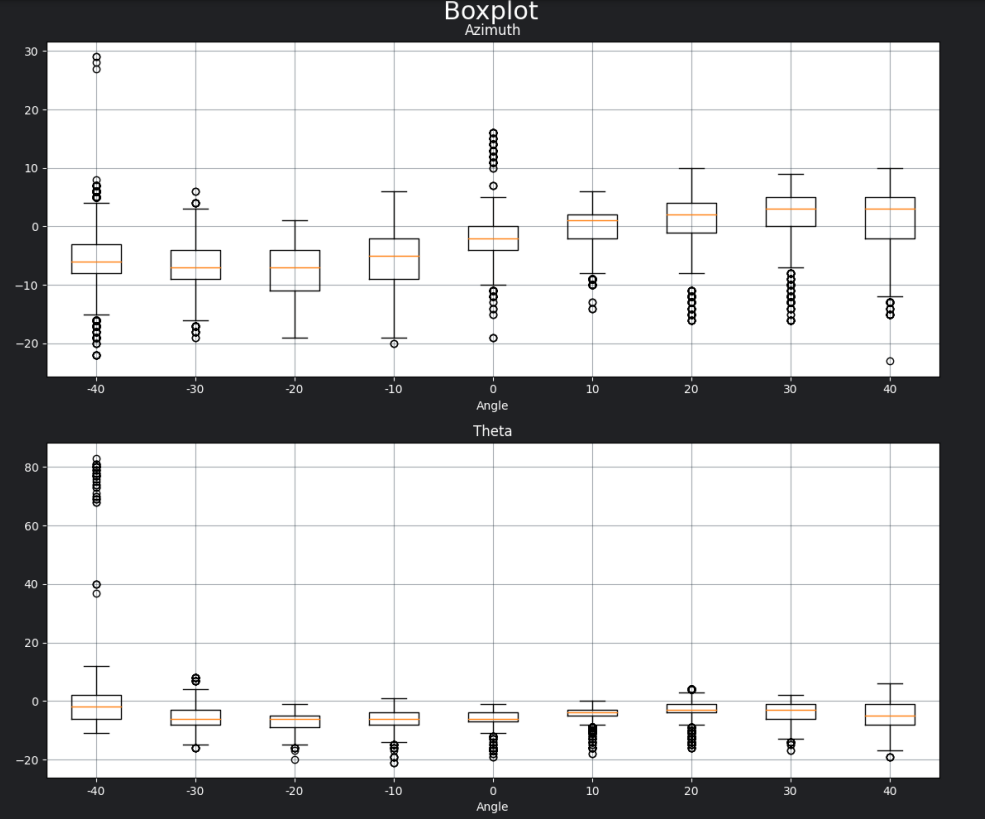
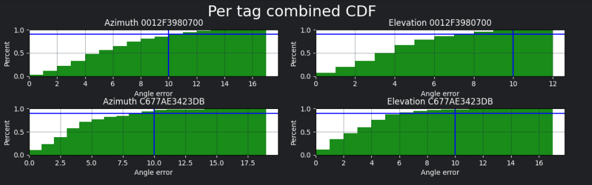
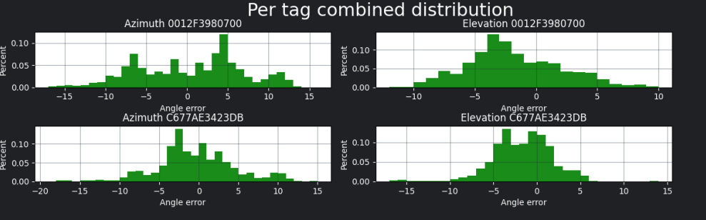
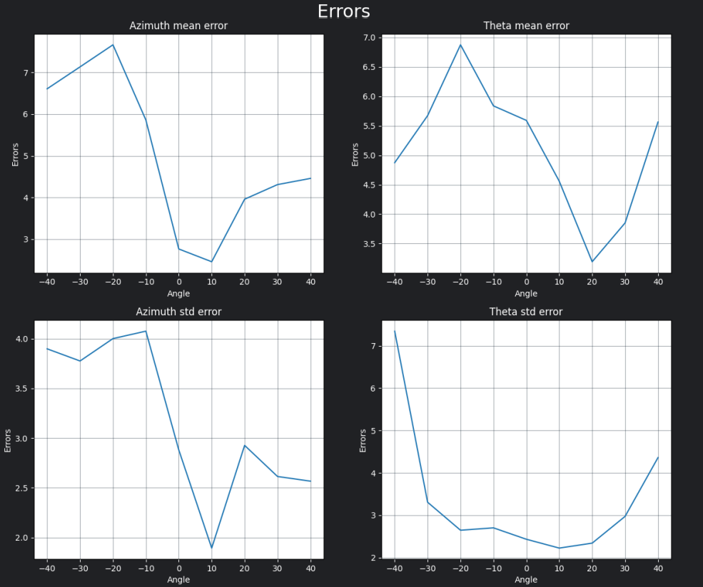
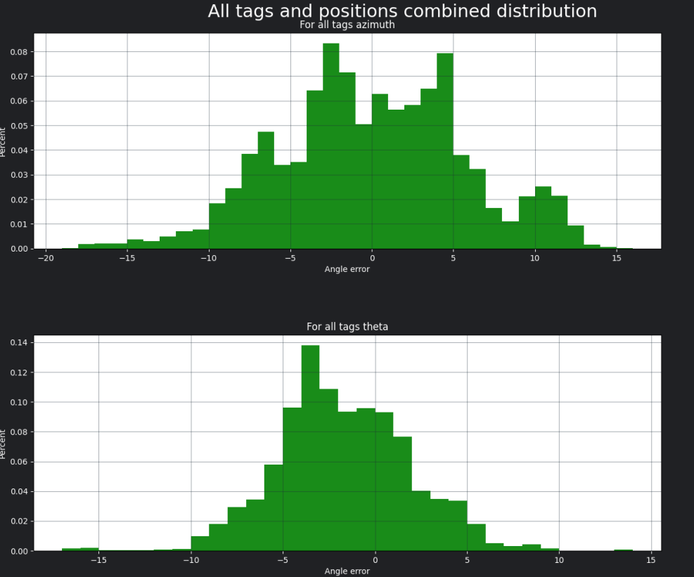

# Bluetooth AoX Antenna Testing Rig
This repository contains three things:
- A two degree of freedom test rig that rotates and tilts.
- ESP32 code for driving the steppers in the test rig.
- Python code for controlling the test rig, collecting data, analzying the data and generating pdf reports.

## About the hardware
- 2 steppers motors and 2 stepper drivers.
- Steppers are 0.9 degree per step and stepper drivers set to 8 micro steps => 3200 steps per revolution.
- ESP32 (u-blox NINA-W106 EVK) for controlling everything.
- The gear ratio between stepper gear and the one on the antenna is 3:1.
- For moving the antenna a differential system is used, this to avoid having the steppers close to the antenna in case they disturb.


## Test rig ESP32 application
Uses WiFi Manager for easy provisioning. Takes commands for moving steppers over UART or websocket.
It uses the default UART for debug logs and takes the commands on the secondary UART on pins `GPIO_NUM_12` and `GPIO_NUM_13`, conveniently those are connected to the second COM port on the u-blox NINA-W10X EVKs making it simple to get both debug logs and control the antenna at the same time. This can easily be changed to run on the default UART in case of a board with one UART.

Commands:
```
ENABLE=<0/1> - Turn on or off the steppers.
TILT=<+-degrees> - Tilt the antenna in degrees relative to the it's current position.
AZIMUTH=<+-degrees> - Rotate the antenna in degrees relative to the it's current position.
GET_ANGLE - Asks for current tilt and rotation relative to change since bootup.
```

### Compiling
Follow instruction on [https://github.com/espressif/esp-idf](https://github.com/espressif/esp-idf) to set up the esp-idf, then just run `idf.py build` or use the [VSCode extension](https://github.com/espressif/vscode-esp-idf-extension). Tested with esp-idf 4.4.

## Python antenna controller and analyzer code
All Python code for controlling the test rig, for data collection and for analysis can be found in the `scripts` folder. Example of the **light version** of generated report not including the live plots and statistics for each individual position can be seen [here (example_report.pdf)](.github/example_report.pdf)

Some examples of supported features:
- `ui_antenna_control.py` - Manual control of the antenna from UI. Analyze in realtime and generate plots afterwards.
- `analyzer.py` - Automatic testing, will move the antenna from negative to positive in both rotation and elevation. The start and end angles and the step size in degree can be changed. Will generate a [pdf report](.github/example_report.pdf) and save all logs when finished.
- `log_analyzer.py` - Run analyzis on already collected logs, end result is the same as from `analyzer.py`.
- `udp_plotter.py` - Starts an UDP server and accepts angles over it from multiple anchors. Takes the tag id as input and plots in realtime the angle each antenna/anchor is giving for the specified tag.

Rest of the files are helpers:
- `aoa_controller.py` - Helper for communication with an antenna running u-blox u-connectLocate SW.
- `antenna_controller.py` - Helper for moving the test rig.
- `live_plot.py` and `live_plot_anchor.py` - Common code for live plotting angles from anchors.
- etc...

### Screenshots
<p float="left">
  
  
</p>



<p float="left">
  
  
</p>

### Installation
In `scripts` folder run:
`pip install -r requirements.txt`

## Usage of python scripts
### analyzer.py

```bash
usage: analyzer.py [-h] --controller_port CONTROLLER_PORT
               [--controller_baudrate CONTROLLER_BAUDRATE] --locate_port
               LOCATE_PORT [--locate_baudrate LOCATE_BAUDRATE] [--no-flow]
               [--webcam] [--name NAME]

```

|short|long|default|help|
| :--- | :--- | :--- | :--- |
|`-h`|`--help`||show this help message and exit|
||`--controller_port`|`None`|Serial port of the antenna controller.|
||`--controller_baudrate`|`115200`|Baudrate of antenna controller|
||`--locate_port`|`None`|Serial port of u-connectLocate module.|
||`--locate_baudrate`|`115200`|Baudrate for u-connectLocate.|
||`--no-flow`||Flag to disable flow control for u-connectLocate, needed to run tests if CTS/RTS are not connected.|
||`--webcam`||Open a window displaying the webcam, can be used to monitor when running remotely.|
||`--name`|``|Name identifying the measurement|
||`--name`|``|Name identifying the measurement|

### ui_antenna_control.py
```bash
usage: ui_antenna_control.py [-h] --port PORT [--baudrate BAUDRATE]
               [--locate_port LOCATE_PORT] [--locate_baudrate LOCATE_BAUDRATE]
               [--no-flow] [--webcam] [--mock]

```

|short|long|default|help|
| :--- | :--- | :--- | :--- |
|`-h`|`--help`||show this help message and exit|
||`--port`|`None`|`None`|
||`--baudrate`|`115200`|Serial port of the antenna controller.|
||`--locate_port`|`None`|Serial port of u-connectLocate module.|
||`--locate_baudrate`|`115200`|Baudrate for u-connectLocate.|
||`--no-flow`||Flag to disable flow control for u-connectLocate, needed to run tests if CTS/RTS are not connected.|
||`--webcam`||Open a window displaying the webcam, can be used to monitor when running remotely.|
||`--mock`||For testing without antenna controller and u-connectLocate. Data will be generated.|

### udp_plotter.py

```bash
usage: udp_plotter.py [-h] [--ip IP] [--port PORT] [--tagId TAG_ID]
               [--max_anchors MAX_ANCHORS]

```

|short|long|default|help|
| :--- | :--- | :--- | :--- |
|`-h`|`--help`||show this help message and exit|
||`--ip`|`0.0.0.0`|The local IP address UDP angles are sent to.|
||`--port`|`54444`|The port UDP angles are sent to.|
||`--tagId`|`None`|Only plot angles from this specific tag.|
||`--max_anchors`|`6`|Adjusts the plot size to fit this number of anchors, default 6.|

### log_analyzer.py
```bash
usage: log_analyzer.py [-h] [--log_dir LOG_DIR] [--remove_90 REMOVE_90]
               [--max_angle MAX_ANGLE] [--antenna_upsidedown] [--swap_angles]

```

|short|long|default|help|
| :--- | :--- | :--- | :--- |
|`-h`|`--help`||show this help message and exit|
||`--log_dir`|`./`|Path to folder with log files in.|
||`--remove_90`||Drop any angles that are +-90, used for testing.|
||`--max_angle`|`90`|Drop all angles utside of the range [-max_angle, max_angle].|
||`--antenna_upsidedown`||If antenna is upsidedown|
||`--swap_angles`||If azimuth and elevation should be swapped. For example if antenna rotated 90 degrees.|

### collect_logs.py
Collects logs from one or multiple antennas at once. Collected logs can then be analyzed using `python log_analyser.py --log_dir the_path`.
```bash
usage: collect_logs.py [-h] --controller_port CONTROLLER_PORT
               [--controller_baudrate CONTROLLER_BAUDRATE] --locate_ports
               LOCATE_PORTS [LOCATE_PORTS ...]
               [--locate_baudrate LOCATE_BAUDRATE] [--no-flow] [--name NAME]

```

|short|long|default|help|
| :--- | :--- | :--- | :--- |
|`-h`|`--help`||show this help message and exit|
||`--controller_port`|`None`|Serial port of the antenna controller.|
||`--controller_baudrate`|`115200`|Baudrate of antenna controller|
||`--locate_ports`|`None`|List of serial ports of u-connectLocate modules.|
||`--locate_baudrate`|`115200`|Baudrate for u-connectLocate. Note all needs to have same baudrate.|
||`--no-flow`||Flag to disable flow control for u-connectLocate, needed to run tests if CTS/RTS are not connected.|
||`--names`|`[]`|List of name identifying the measurements. Should be same length as --locate_ports.|
